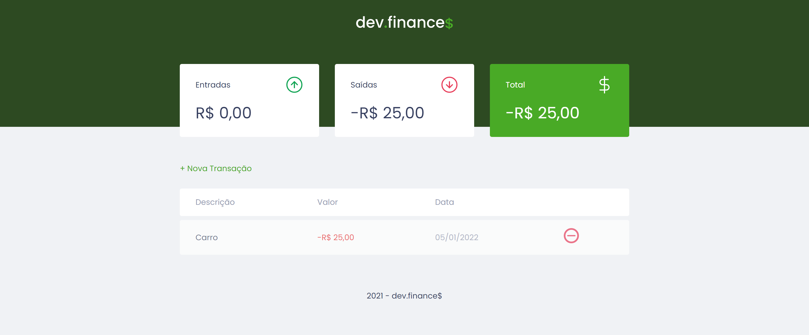

<h1 style="text-align: center; font-weight: bold;">Dev.finance$</h1>

## Demonstração 📸

  

---

## Sobre o Projeto

Projeto realizado no maratona Discover da Rocketseat, a fim de aprimorar os conhecimentos em javascript.
  
Link do projeto: https://dev-finance-vert.vercel.app/

### 🛠 Tecnologias

As seguintes ferramentas foram usadas na construção do projeto:

- [HTML5]
- [CSS3]
- [JavaScript]
---

 

Veja meu Linkedin: [LEANDRO ARAÚJO] 